# FJNU_Library_Booking
超星图书馆座位预约脚本

## 注意

1. 这份代码只支持滑块验证码，但是手动预约需要点按式验证码，又但是这份代码确实能用（估计是旧的验证码没被完全ban掉）
2. 只支持座位，而非静音仓
3. 代码来源：https://github.com/bear-zd/ChaoXingReserveSeat
4. 2026/1/14亲测能用

## 如何使用

### 本地部署方式

去看[原作者](https://github.com/bear-zd/ChaoXingReserveSeat/blob/rebuild/README.md)的吧~

### github actions部署方式

1. **fork该仓库**

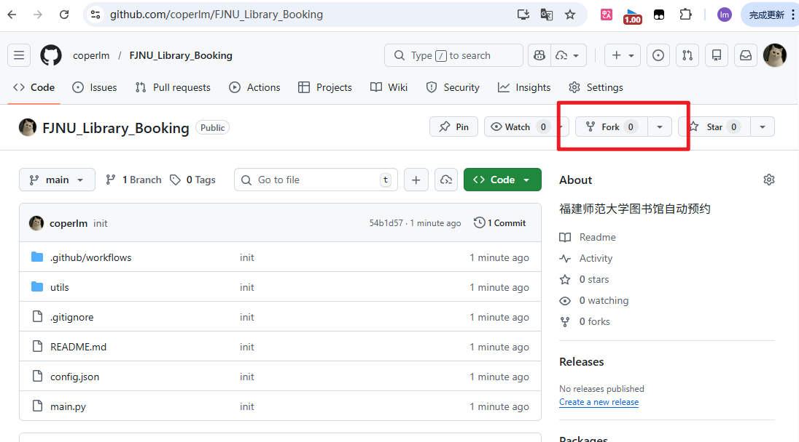

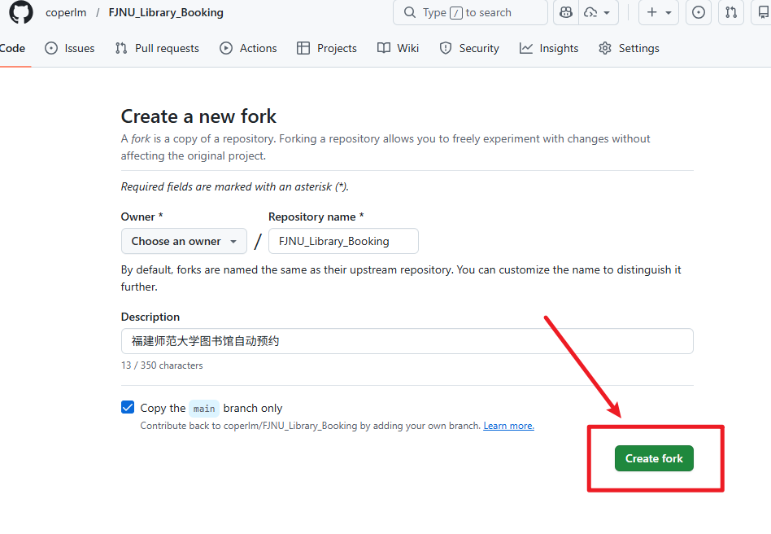

2. **修改config.json**

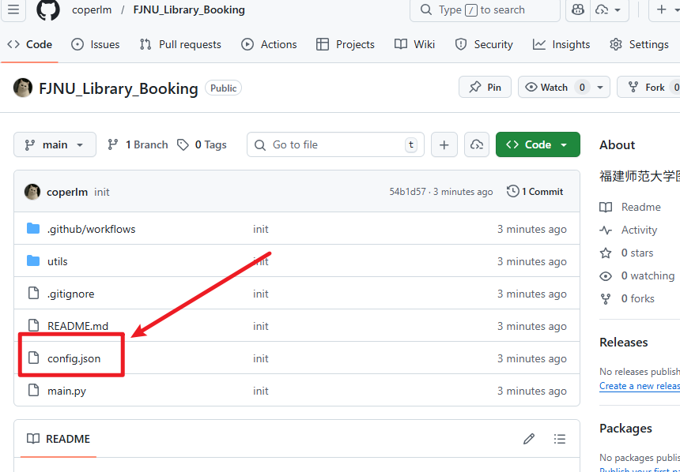

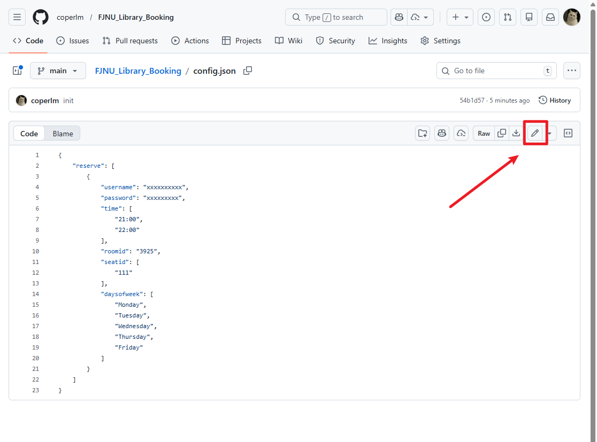

roomid参照下表

```
仓山-一楼-大厅 3916
仓山-二楼-综合书库 3919
仓山-三楼-阅览厅 3923
旗山-一楼-24小时书房 4036
旗山-二楼-知明学习室 3929
旗山-二楼-行笃学习室 6425
旗山-三楼-立诚学习室 4019
旗山-三楼-过道阅览区 3928
旗山-三楼-致广学习室 6061
旗山-四楼-中文图书厅库 3927
旗山-五楼-中文图书厅库 3926
旗山-六楼-过道阅览室 12596
旗山-七楼-中外文图书厅库 3925
仓山-四楼-中文图书样本库 3924
协和学院图书馆-一楼-数字阅读区 12041
协和学院图书馆-一楼-一楼休闲阅读区 12042
协和学院图书馆-一楼-一楼自习一区 12043
协和学院图书馆-一楼-一楼自习二区 12044
协和学院图书馆-一楼-一楼卡座 12045
协和学院图书馆-二楼-二楼第四书库 12046
协和学院图书馆-二楼-二楼第五书库 12047
协和学院图书馆-二楼-二楼学生阅读厅 12048
协和学院图书馆-二楼-二楼中厅 12049
协和学院图书馆-三楼-三楼第一书库 12050
协和学院图书馆-三楼-三楼第三书库 12051
协和学院图书馆-三楼-三楼中厅 12052
```

例如图中是`3925`，即`旗山-七楼-中外文图书厅库`

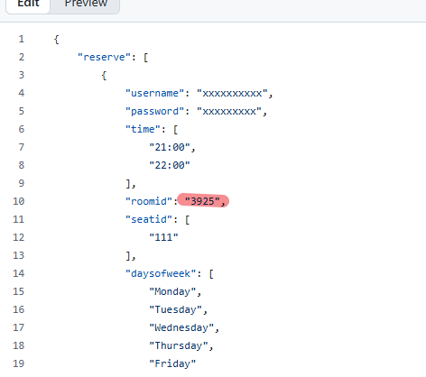

座位号`seatid`和app里的一样，星期`daysofweek`和具体时间`time`也自己选，然后保存即可

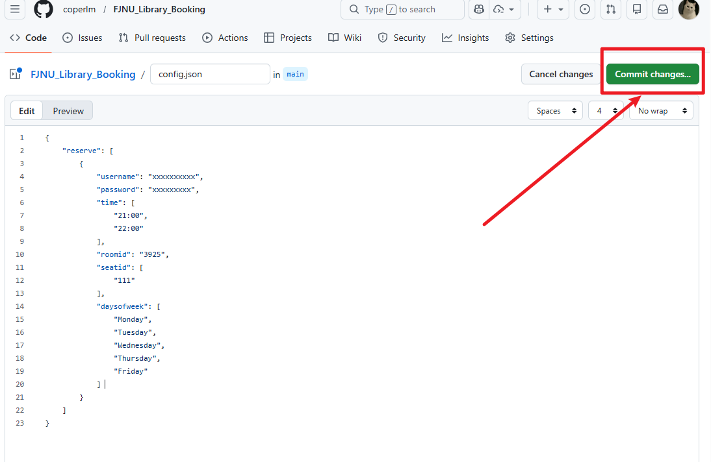

username和password请留空或者随便填，以防止泄漏个人账号密码。

3. **配置账号密码**

在settings->secrets and variables->Repository secrets 创建两个secret keys。名称分别为`USERNAMES`，`PASSWORDS`，填写自己的账号和密码即可。

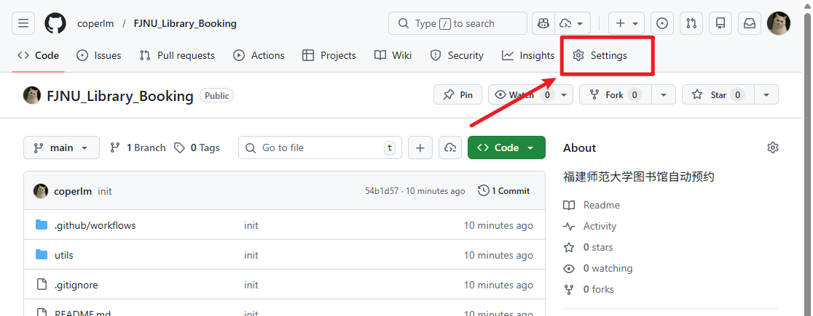

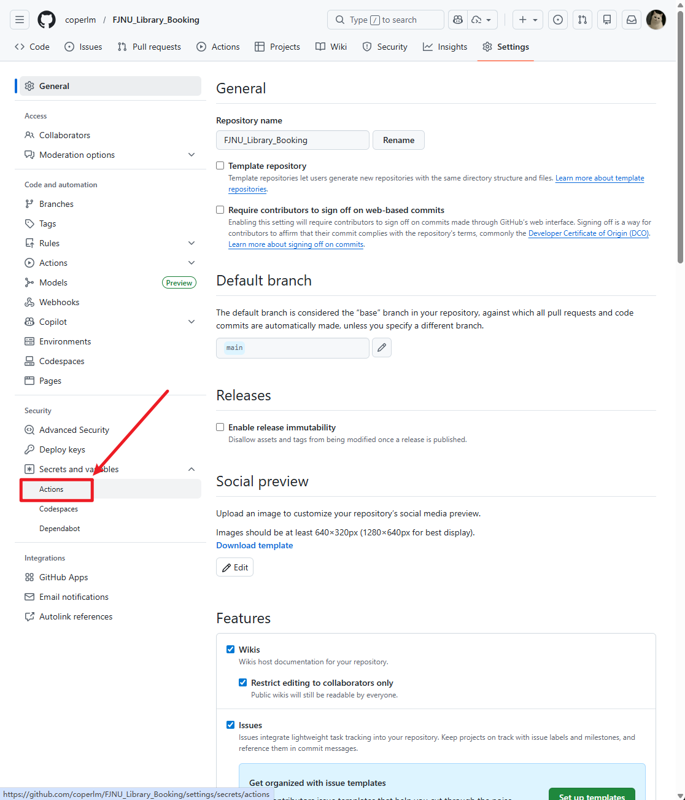

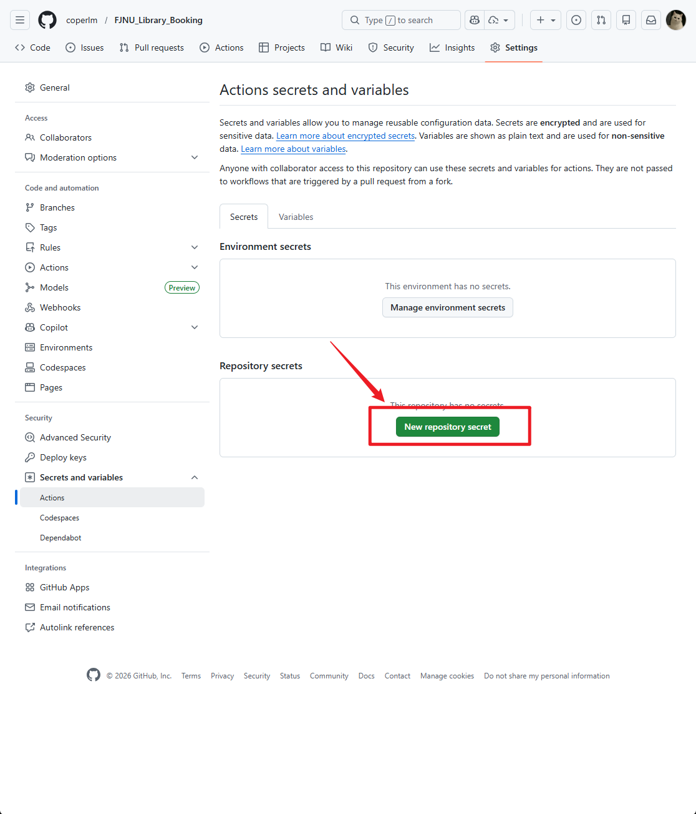

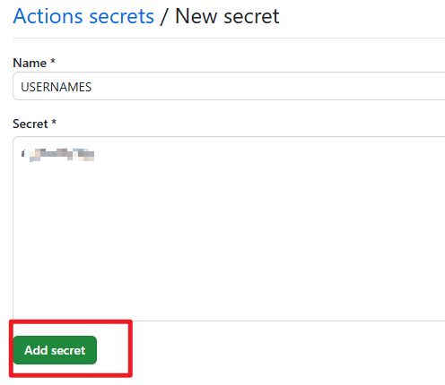

变成这样即可

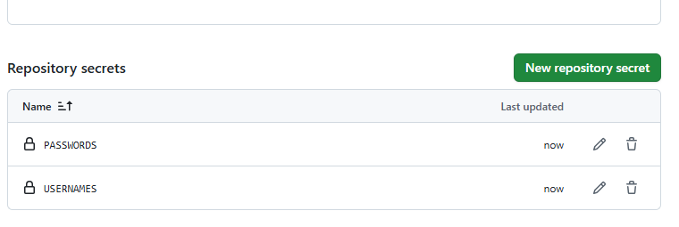

在这个网站查看是否可以顺利登陆，检验账号密码是否正确 https://passport2.chaoxing.com/mlogin?loginType=1&newversion=true&fid=&  

4. **运行action**

在action -> auto_reserve -> run workflows 选择main分支即可

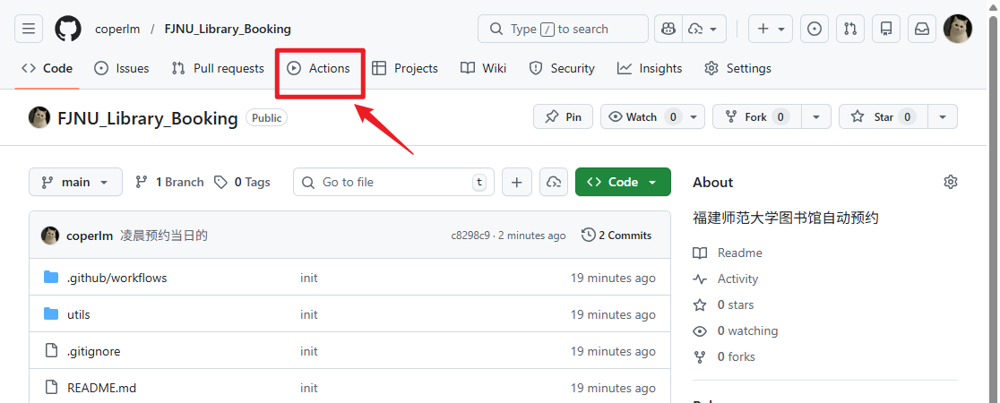

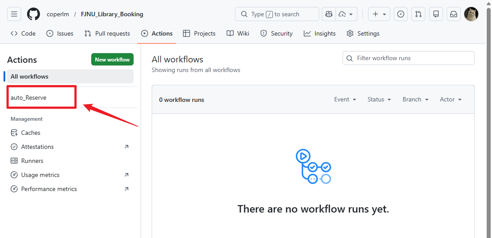

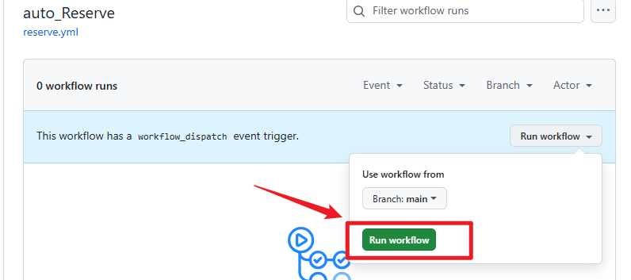

## 后记

我才发现富士达的图书馆可以提前两天预约，所以根本没必要（哭
